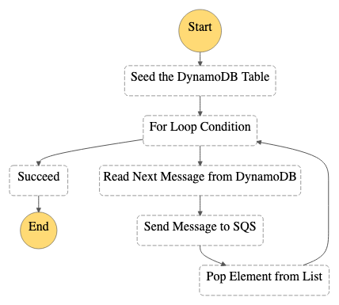

# terraform-aws-step-functions

This sample project demonstrates how to read values from an Amazon DynamoDB table and send them to Amazon SQS using AWS Step Functions. Deploying this sample project will create a Step Functions state machine, a DynamoDB table, an AWS Lambda function, and an Amazon SQS topic.

In this project, Step Functions uses the Lambda function to populate the DynamoDB table, uses a for loop to read each of the entries, and then sends each entry to Amazon SQS.



---------------------------------------------------------------
## Pre-requisites

Only using AWS services, an AWS account is required.

You will need to install [Terraform](https://learn.hashicorp.com/tutorials/terraform/install-cli).

---------------------------------------------------------------
## Deploying to the cloud

First the Lambda code needs to be compressed
```
zip -r lambda_function_payload.zip ./definitions/index.js
```
After that deployment can be started
```
cd terraform 

tf init 
tf plan 
tf apply
```
In order to tear down the entire infrastructure use 
```
tf destroy
```

---------------------------------------------------------------
## Usefull information

If you want to use Terraform with an AWS profile the only way it worked for me was using the following command:

```
export AWS_PROFILE= <profile>
```
For some reason the method provided in the [documentation](https://registry.terraform.io/providers/hashicorp/aws/latest/docs) did not work:
```
provider "aws" {
  region                  = "us-west-2"
  shared_credentials_file = "/Users/tf_user/.aws/creds"
  profile                 = "customprofile"
}
```
